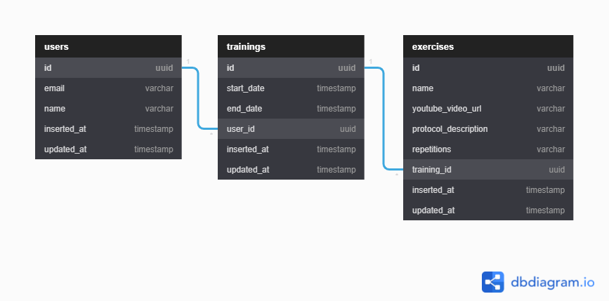

# Next Level Week 06 - Elixir 🚀

Repositório do projeto em Elixir da NLW06

## Projeto - Wabanex 🏋️‍♀️

Gerenciamento de treinamentos pelo `Elixir` usando `GraphQL`.

### Tecnologias 💻

- `Elixir`
- `Ecto`
- `Phoenix`
- `Absinthe`

### Estrutura do banco de dados 🎲

## Autor 😸

- [GitHub](https://github.com/Nxrth-x)
- [LinkedIn](https://linkedin.com/in/lima-eder)
- [Facebook](https://facebook.com/DCCLXXIX)

## Rocketseat 👨‍🚀🚀

- [Next Level Week](https://nextlevelweek.com/)
- [Rocketseat](https://rocketseat.com.br)
